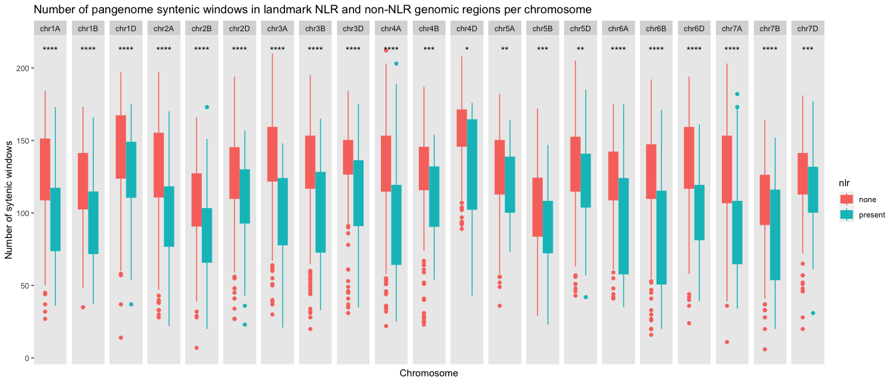

NLR Distributions on the wheat genome
================
Bernice Waweru
5/1/23

Preliminary hypothesis is that within NLR regions there we observe more
variability, and only lines with similar haplotypes/variation will group
together within NLR regions. Which suggest that the introgressions
within haplo-blocks would be from the same origin. Outside the NLR
regions, we expect to observe more similarities among the
lines/pangenomes.

### Objective in this analysis

To evaluate this, first we look at the number of syntenic windows and
haplotypes in blocks with NLRs annotated and those without any NLRs
across the pangenome references. A block is a 1 megabase pair region, (1
Mb). Within each block there are 20 50,000 base pair windows (50kb). In
a block with high similarity across all the pangenome lines, we expect
up to a total of 220 window that is 20 windows from all of the pangenome
lines (20 \* 11). Where there is considerably fewer windows, we think
this might the blocks with NLRS and we get syntenic windows only from
the pangenome references that share or have similar NLR clusters within
the blocks.

This however might change based on the reference that is used to extract
the syntenic windows, obviously there is strength in numbers, hence
patterns observed in majority of pangenomes or those known to be similar
at at particular regions will be more useful and provide targets for
more analysis.

Data on NLRs annotated on the Chinese spring ReqSeq genome was obtained
from table S5 in the paper by [Burkard et
al.,2020](https://pubmed.ncbi.nlm.nih.gov/32184345/) on tool to annotate
NLRs. He used the same tool to annotate NLRs in the other pangenome
reference genomes.

#### First is to extract the data

Did this with the below script, that will be refined to have an array to
submit a script based on the pangenome assembly being used

``` bash

#!/bin/bash
#SBATCH --partition=jic-short,nbi-medium,jic-medium,nbi-long,jic-long,RG-Cristobal-Uauy
#SBATCH --nodes=1
#SBATCH --cpus=1
#SBATCH --mem 100G
#SBATCH -o /jic/scratch/groups/Cristobal-Uauy/waweru/extract_variations_nov2022/scripts/batch_logs/get_syn_win.%N.%j.out # STDOUT
#SBATCH -e /jic/scratch/groups/Cristobal-Uauy/waweru/extract_variations_nov2022/scripts/batch_logs/get_syn_win.%N.%j.err # STDERR
#SBATCH --array=1-10
#SBATCH --job-name=extract_syntenic_windows

# S B A T C H --localscratch=ssd:200

i=$SLURM_ARRAY_TASK_ID

# ====== declare th reference database, for each refernce there will be a slurm job created

declare -a references=(\
"arinalrfor" \
#"chinese" \
"jagger" \
 "julius" \
 "lancer" \
 "landmark" \
 "mace" \
 "norin61" \
 "stanley" \
 "sy_mattis" \
 "spelta" \
)


reference=$(($i%10))
reference=${references[$reference]}


#======== declare variables that can be changed based on target data ==========
group=WatSeq_Pangenome_RAGT_ABD # grouping, line used in the affinity propagation
dmp_dir=high_dmp # the dmp values range used in affinity propagtion
ibs_window=50000

#assembly=chinese , declared in the references above

# this is the directory with the ap files for each reference
db_dir=~/14_watseq_affinity/groups/${group}/${reference}/${dmp_dir}/${ibs_window}w
echo ${db_dir}

###  the goal is to get the number of syntenic windows and number of haplotypes observed per mb in the file of interest
### the files are generated per chromosome, so we can loop over the pangenomes and the chromosomes

#==== to manipulate the file to get what we need, we need commands to do the following

#=== 1. we need to get the data from one query, essentially, all the queries will have the same number of windows and haplotypes observed, just a different haplotype group,
#=== 2. extract data based one query after creating the query variable,
#=== 3. filter for unique values based on the start and end column, for every mb, this will be the same, and the values for number of syntenic windows and number of haplotype grous will be the same for all the rows representing the same MB

# the name of the query does not really matter, here we get the name of the last query in the file for chr1A,
# because this takes time, we get the query from the first chr1A, and reuse the query name rather than get the query name every time the loop goes through the 21 files
# the chromosome is looped over
chromosome=chr1A # chromosome of interest

in_file=$db_dir/${chromosome}_${reference}_19w_${group}.tsv.gz
echo $in_file

query=$(zless ${in_file} | awk '{print $4}' | tail -n 1)
echo ${query}

# this is the main output output directory
out_dir="~/extract_variations_nov2022/syntenic_window_haplotype_numbers"

#make an output directory and use this based n which pangenome assembly we are extracting data from, so the data is stored in the correct the folder

echo ${reference}
mkdir -p ${out_dir}/${reference}
out_dir=${out_dir}/${reference}

echo ${out_dir}

# use the query to filter for the data and then get unique rows based on the 2 and 3 columns that are the start and end column of the MB respectively

#zcat ${in_file} | awk -v x=${query} -F "\t" '{if ($4 == x) print $0}' >  test_awk_cat_.out

#zcat ${in_file} | awk -v x=${query} -F "\t" '{if ($4 == x) print $0}'  | awk -F "\t" '!seen[$2, $3]++' >  result.out

# using awk seem to be getting different results all the time, try using grep instead
# the awk command selects for uniq values in the 2 and third column, and this is what worked best,
# best to do it on the cluster, uses quite a bit of memory to hold all the data.
# grep works better to extract all the rows with the query in the variable/


# now to make it into a loop that will process all the chromosomes and all the pangenome references
# eventually we need to make an array kind of script that will submit as many jobs as the pangenome references ## DONE above


# chrom_name=${chromosome}_${assembly}_19w_${group}.tsv.gz
#done
#done

for file in ${db_dir}/chr[1234567][ABD]_${reference}_19w_${group}.tsv.gz ;\
 do echo ${file} ;\
# query=$(zless ${file} | awk '{print $4}' | tail -n 1) ;\
# echo ${query} ;\

# get the output file names from the input file names

out=$(echo ${file} | cut -d "/" -f 12 | sed 's/_19w_WatSeq_Pangenome_RAGT_ABD.tsv.gz//g') ;\
echo ${out} ;\
# extract required data and save in the appropriate under the correct name
 time zcat ${file} | grep -w  ${query} | awk -F "\t" '!seen[$2, $3]++' > ${out_dir}/${out}_${group}_syntenic_windows_haplotype_numbers.txt
done

#time zcat ${in_file} | grep -w  ${query} | awk -F "\t" '!seen[$2, $3]++' > ${out_dir}/${assembly}_${chromosome}_${group}_syntenic_windows_haplotype_numbers.txt
```

With the information on the number of syntenic windows and haplotypes
per block, next we need to combine that with the data on which blocks
have NLRs annotated.

We have two data frames, essentially two vectors that we need to compare
based on position. To make it easier to work we round off the positions
(coordinates) to MB so that its easier to compare the two.

##### Import files with window and haplotype information

Because the affinity propagation is done per chromosome, the files we
have are also by chromosome, hence we have 21 files.

But the data on annotated NLRs contains information on all the
chromosomes in one file. Because we know all the files extracted per
reference have the same number of columns, we can import and bind all of
the 21 files into one file.

We use the below command, from
[here](https://www.statology.org/r-merge-csv-files/).

``` r
library(dplyr)
library(readr)
library(magrittr)
library("ggpubr")
library(ggplot2)
```

``` r
#import and merge all three CSV files into one data frame
# this works, with read.table, but has funny row names/numbers that need to be removed before further processing
# it works when the path is the working directory, so we have to change our working directory to the directory with the data before we run the code

# to work with all the references easily, make the reference a variable that can be changed easily

# the files are per chromosome, in a folder for each ref, which are all in this base directory

base_dir <- "/Volumes/waweru/2022/kmc_IBSpy_AP/NLR_annotator_Burkhard_2020/syntenic_window_haplotype_numbers"
base_dir
```

    [1] "/Volumes/waweru/2022/kmc_IBSpy_AP/NLR_annotator_Burkhard_2020/syntenic_window_haplotype_numbers"

``` r
# arinalrfor, chinese, jagger, julius, lancer, stanley, landmark, mace, norin61,

#spelta, sy_mattis
reference <- "landmark"
reference
```

    [1] "landmark"

From the reference directory, list files to check that file path is
correct then read in all the files simultaneously

``` r
# list file form where we have our data, files we need have a text , add this as a pattern to recognize the s that we don't' have the error of trying to read the out put directory.

list.files(path = paste0(base_dir,"/",reference), pattern = "*_numbers.txt$")

# does not work to change the working directory from here, weird, had to do it form the files panel, have to figure out a way around this for ease of running the code,
# Feb_03, worked with path derived from variables, interesting
setwd(paste0(base_dir,"/",reference))
getwd()


# data is imported properly without the weird row numbers which is great!

dat <- list.files(path = paste0(base_dir,"/",reference), pattern = "*_numbers.txt$") %>% 
  lapply(read.table, sep = "\t") %>%
  bind_rows 

# data has the 17 columns in the ap result file,  name them accordingly

header_names<- c("chr", "start", "end", "query", "window", "variations", "variations_scl", "group", "sc_score","damping", "w_num", "dmp_num", "std", "median", "mean","skew","kurt")
length(header_names)

names(dat) <- header_names

head(dat)

# check that we have data from all the 21 chromosomes

dat %>% select(chr) %>% unique() %>% nrow() # it only has 19, its missing chromosome 2B and 6A

# select the columns of interest
# w_nume here is the number of syntenic windows and 
# dmp_num is the number of haplotype groups that were found in that 1MB block

dat <- dat %>% select(chr, start, end, w_num, dmp_num)

#
head(dat)
# we need a chr column in the data frame so we can use for comparison with the nlr data set
# we use substr to extract the first 5 characters which are the chromosome position

dat <- dat %>% mutate(chr_pos = substr(chr,1,5))
head(dat)

# also required is to have a column with coordinates on MB to compare

dat <- dat %>% mutate(chr_start = floor((start/1000000)))
head(dat)
```

##### Import file with NLR information

The file with the chinese NLR annotation is in excel format

Create a variable for this as well so that one need to change only the
reference name

``` r
#chinese_nlrs <- readxl::read_xlsx(path = "/Volumes/waweru/2022/kmc_IBSpy_AP/NLR_annotator_Burkhard_2020/chinese_NLR_annotations.xlsx", sheet = 2, col_names = TRUE)

# the directory where the nlr annotation files for all the pangenomes and a few varieties are.
# some of the names to match the how the pangenomes are named, so that we can use the same reference variable that is use thread the files

nlr_dir <- "/Volumes/waweru/2022/kmc_IBSpy_AP/NLR_annotator_Burkhard_2020/pangenome_references_NLR_annotations_Jan_2023"

nlrs <- read.table(paste0(nlr_dir,"/",reference,".nlr.txt"), sep = "\t", header = T)

# sort the data based on the chromosome
nlrs <- nlrs[order(nlrs$chr),]
head(nlrs)
```

           chr          ID Completeness   start     end Strand
    2480 chr1A chr1A_nlr_1     complete 2906820 2909673      +
    2481 chr1A chr1A_nlr_2     complete 3179649 3182585      +
    2482 chr1A chr1A_nlr_3     complete 3194587 3224137      +
    2483 chr1A chr1A_nlr_4     complete 5180588 5184638      +
    2484 chr1A chr1A_nlr_5     complete 5239580 5243648      +
    2485 chr1A chr1A_nlr_6     complete 5331234 5333663      +
                                                                             Motifs
    2480                                      17,16,14,1,6,4,5,10,3,12,2,8,7,11,9,9
    2481                                      17,16,14,1,6,4,5,10,3,12,2,8,7,11,9,9
    2482                                        17,16,14,1,6,4,5,10,3,12,2,8,7,11,9
    2483          17,16,1,6,4,5,3,12,2,8,7,9,11,11,11,11,11,11,11,11,11,11,11,11,11
    2484 17,16,1,6,4,5,3,12,2,8,7,9,11,11,19,11,11,11,11,11,11,11,11,11,11,11,11,11
    2485                                               17,14,1,6,4,5,10,3,12,2,8,11

``` r
#names(nlrs)
# we want to get the position of the nlrs down the nearest MB, hence we will divide the coordinate by 1000000 then `floor` to round down to the nearest integer 
# we then group by chromosome and then return only the unique values per chr

nlrs_uniq <- nlrs %>% mutate(start_pos = floor((start/1000000)), end_pos = floor((end/1000000))) %>% group_by(chr) %>% distinct(start_pos)
#order/sort per chom by position
nlrs_uniq <- nlrs_uniq[order(nlrs_uniq$chr, nlrs_uniq$start_pos),]
head(nlrs_uniq, n=20)
```

    # A tibble: 20 × 2
    # Groups:   chr [1]
       chr   start_pos
       <chr>     <dbl>
     1 chr1A         2
     2 chr1A         3
     3 chr1A         4
     4 chr1A         5
     5 chr1A         6
     6 chr1A         7
     7 chr1A         8
     8 chr1A         9
     9 chr1A        10
    10 chr1A        11
    11 chr1A        13
    12 chr1A        14
    13 chr1A        15
    14 chr1A        17
    15 chr1A        21
    16 chr1A        59
    17 chr1A        98
    18 chr1A       121
    19 chr1A       261
    20 chr1A       298

##### Check for nlrs

This is effective, but takes a very long time, how to make it
faster,maybe write in python instead

Immediately save it as csv so its not lost.

``` r
#initialize a column with information of whether nlr is present or not, for now it has none in all rows, but will be replaced with present where an an nlr is present
dat$nlr <- "none"

for (row in 1:nrow(dat)) {
  chrom <- dat[row, "chr_pos"]
  pos <- dat[row, "chr_start"]
  
  print(chrom)
  print(pos)
  
  for (line in 1:nrow(nlrs_uniq)){
    nlr_chr <- nlrs_uniq[line, "chr"]
    nlr_pos <- nlrs_uniq[line, "start_pos"]
    
    if(chrom==nlr_chr & pos==nlr_pos ){
      n <- paste("present")
      dat$nlr[row] <- n
    }
  }
  
  
}


# create a result directory where all the files and images generated related the reference will be stored

dir.create("outputs")

write.csv(dat, file = paste0(base_dir,"/",reference,"/","outputs","/",reference,"_syn_hap_nlrs.csv"), quote = FALSE)
```

##### Plot

We want to see the number of syntenic windows within windows with NLRs
and those without.

``` r
dat <- read.csv(paste0(base_dir,"/",reference,"/","outputs","/",reference,"_syn_hap_nlrs.csv"), header = T)
dat$X <- NULL
head(dat)
```

             chr   start     end w_num dmp_num chr_pos chr_start     nlr
    1 chr1A__ldm       1 1000000   111      15   chr1A         0    none
    2 chr1A__ldm 1000001 2000000   113      17   chr1A         1    none
    3 chr1A__ldm 2000001 3000000    95       6   chr1A         2 present
    4 chr1A__ldm 3000001 4000000   118      15   chr1A         3 present
    5 chr1A__ldm 4000001 5000000    63      25   chr1A         4 present
    6 chr1A__ldm 5000001 6000000    36      17   chr1A         5 present

``` r
library(ggplot2)

dat %>% ggplot(aes( x = chr_pos, y = w_num, fill = nlr)) +
  geom_boxplot() 
```


``` r
  #facet_wrap(~nlr, ncol = 1)


# to check whether there is a significant difference between groups do do a test to compare?

#if(!require(devtools)) install.packages("devtools")
#devtools::install_github("kassambara/ggpubr")
```

From the preliminary first plot it looks like there is some difference
between groups, to cement, check with sample comparison tests.

Check if the data meets the assumptions of comparison of means then
compute either parametric or non-parameteric test.

``` r
res <- t.test(w_num ~ nlr, data = dat)
res
```


        Welch Two Sample t-test

    data:  w_num by nlr
    t = 26.172, df = 1405.4, p-value < 2.2e-16
    alternative hypothesis: true difference in means between group none and group present is not equal to 0
    95 percent confidence interval:
     25.31728 29.41994
    sample estimates:
       mean in group none mean in group present 
                 127.5215              100.1528 

First check that the data are normally distributed using Shapiro-Wilk
normality test

``` r
library(dplyr)

# first summarise the data

group_by(dat, nlr) %>% summarise(count = n (),
                                         mean = mean(w_num),
                                         sd = sd(w_num))
```

    # A tibble: 2 × 4
      nlr     count  mean    sd
      <chr>   <int> <dbl> <dbl>
    1 none    12933  128.  30.3
    2 present  1230  100.  35.5

``` r
group_by(dat, nlr) %>% summarise(count = n (),
                                         median = median(w_num),
                                         IQR = IQR(w_num))
```

    # A tibble: 2 × 4
      nlr     count median   IQR
      <chr>   <int>  <dbl> <dbl>
    1 none    12933    130    40
    2 present  1230    101    53

``` r
library("ggpubr")
ggboxplot(dat, x = "nlr", y = "w_num", 
          color = "nlr", palette = c("#00AFBB", "#E7B800"),
          ylab = "Number f Syntenic Windows", xlab = "NLR")
```


``` r
# check for normality
with(dat, shapiro.test(w_num[nlr == "present"])) # p-value = 3.664e-05, significantly not normally distributed
```


        Shapiro-Wilk normality test

    data:  w_num[nlr == "present"]
    W = 0.991, p-value = 7.714e-07

``` r
#with(dat, shapiro.test(w_num[nlr == "none"])) # error that sample size must be between 3 to 5000, this has 13423,

# check for equal variance variance

res.ftest <- var.test(w_num ~ nlr, data = dat)
res.ftest # pvalue is lower than the significance level of 0.05, hence variances are not equal
```


        F test to compare two variances

    data:  w_num by nlr
    F = 0.73172, num df = 12932, denom df = 1229, p-value = 1.013e-14
    alternative hypothesis: true ratio of variances is not equal to 1
    95 percent confidence interval:
     0.6726254 0.7937162
    sample estimates:
    ratio of variances 
             0.7317154 

The data sets are not normally distributed and the variance is not the
same, so to compare means we will use a non-parametric test, Wilcoxon
test.

``` r
res.wilcx <- wilcox.test(w_num ~ nlr, data = dat)
res.wilcx$p.value
```

    [1] 9.423221e-145

The resulting p-vlaue is less than the significance level at 0.05,
indicating a significant difference between the two groups

How to visualize with the significance values added?

``` r
# the `colour` argument give colored outliers and boxplot lines

#pdf(file = paste0(base_dir,"/",reference,"/","outputs","/",reference,"_syn_hap_nlrs.pdf"), height = 6, width = 12) 

#png(filename = paste0(base_dir,"/",reference,"/","outputs","/",reference,"_syn_hap_nlrs.png"),height = 6, width = 12, res = 300, units = "in")
p <- dat %>% ggplot(aes( x = chr_pos, y = w_num, colour = nlr, fill = nlr)) +
  geom_boxplot(outlier.colour = NULL) +
  facet_wrap(~ chr_pos, ncol = 21, scales = "free_x") 


p <- p + stat_compare_means(aes(label = ..p.signif..), 
                        label.x = 0.7, label.y = 210)

# title and axis labels

p <- p + xlab("Chromosome") +
   ylab(("Number of sytenic windows")) +
  ggtitle(paste0("Number of pangenome syntenic windows in ",reference, " NLR and non-NLR genomic regions per chromosome"))

# remove x axis labels as they are same as grid labels
p <- p + theme(axis.text.x = element_blank(),
          axis.ticks.x = element_blank(),
     # format grid lines
     panel.grid.major = element_blank(),
     panel.grid.minor = element_blank())

print(p)
```



``` r
#dev.off()
```

<figure>

<figcaption aria-hidden="true">Lancer</figcaption>
</figure>

###### Useful resources

1.  https://campus.datacamp.com/courses/intermediate-r-for-finance/loops-3?ex=10
2.  https://www.dataquest.io/blog/control-structures-in-r-using-loops-and-if-else-statements/
3.  https://statisticsglobe.com/r-extract-first-or-last-n-characters-from-string
4.  https://stackoverflow.com/questions/24619783/for-loop-r-create-and-populate-new-column-with-output
5.  https://ggplot2-book.org/polishing.html#theme-axis
6.  http://www.sthda.com/english/articles/24-ggpubr-publication-ready-plots/76-add-p-values-and-significance-levels-to-ggplots/
7.  http://www.sthda.com/english/wiki/comparing-means-in-r
8.  http://www.sthda.com/english/wiki/ggplot2-title-main-axis-and-legend-titles
9.  https://www.statology.org/ggplot-remove-gridlines/
