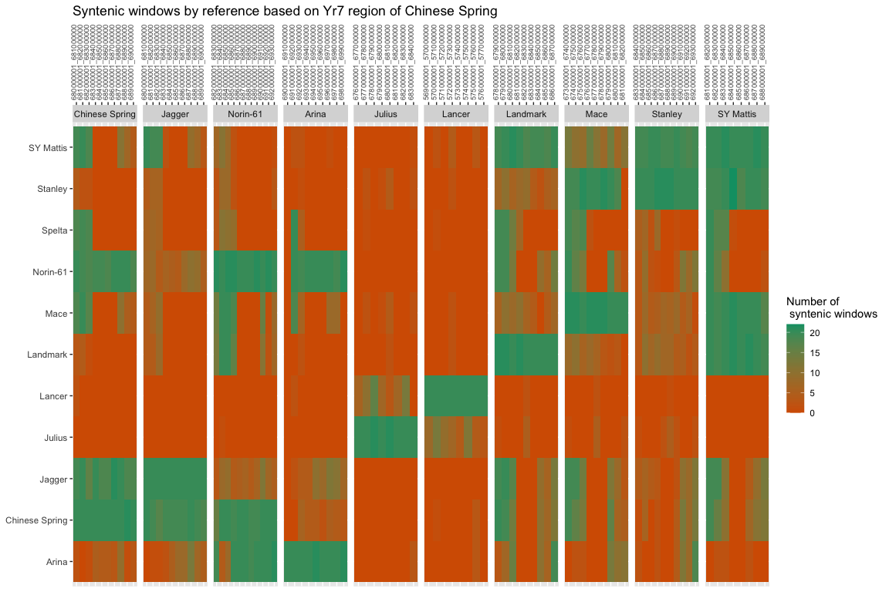

Methods used to extract relevant variation and haplotype data
================
Bernice N Waweru
2023-05-01

### Extract data

Affinity propagation data that is most recent found in the folder
[here](/Volumes/Research-Groups/Cristobal-Uauy/Jesus/14_watseq_affinity/groups),
based on the `groups` that were used to run the clustering with AP. From
the [Marchal et
al.,2018](https://www.nature.com/articles/s41477-018-0236-4.pdf) paper,
the list of varieties/queries to use first are here:
`/Users/waweru/Documents/2022/kmc_IBSpy_AP/Yr5-7-Sp_2B_nov_2022/yellow_rust_uniq_queries_with_IBSpy_data_238_sorted_list_dec062022.txt`.
The list contains 243 names of queries and others are pangenomes
reference names as in the table below. For more information added the
pangenome lines as queries to the list, some of which have multiple
entries (different coverage). Final list has 255 queries.

``` r
require(magrittr)
```

    ## Loading required package: magrittr

``` r
require(kableExtra)
```

    ## Loading required package: kableExtra

``` r
yr5_7_queries <- read.table(file = "/Users/waweru/Documents/2022/kmc_IBSpy_AP/Yr5-7-Sp_2B_nov_2022/yellow_rust_uniq_queries_with_IBSpy_data_238_sorted_list_dec062022.txt")
#yr5_7_queries$X <- NULL
names(yr5_7_queries) <- "query"
nrow(yr5_7_queries)
```

    ## [1] 255

``` r
yr5_7_queries %>% head()
```

    ##       query
    ## 1   ability
    ## 2     Agron
    ## 3      Alba
    ## 4 Albatross
    ## 5    Alcedo
    ## 6     Alert

The list is used in the script to extract the data from the position we
need from the larger file with the data on chromosome 2B. Using data
from group `WatSeq_Pangenome_ABD`, with 1124 queries as in the table.

``` r
ap_file_group_queries <- read.table(file = "/Users/waweru/Documents/2022/kmc_IBSpy_AP/Yr5-7-Sp_2B_nov_2022/query_list_ap_WatSeq_Pangenome_RAGT.txt")
names(ap_file_group_queries) <- "query"
ap_file_group_queries %>% head()
```

    ##       query
    ## 1   ability
    ## 2     Agron
    ## 3      Alba
    ## 4 Albatross
    ## 5    Alcedo
    ## 6     Alert

From the affinity propagation result file, corresponding rows of data
for queries in the yr query list are extracted with the below script. In
the query list to capture all the various lines of a query with
different versions/dataset (mainly the pangenome lines), have it in
small caps in the genotype/query list file

To extract data from all references, the switch was the name of the
reference and the start and end coordinates accordingly.

``` bash
#!/bin/bash
#SBATCH --partition=jic-short,nbi-medium,jic-medium,nbi-long,jic-long,RG-Cristobal-Uauy
#SBATCH --nodes=1
#SBATCH --cpus=1
#SBATCH --mem 10G
#SBATCH -o ~/extract_variations_nov2022/scripts/batch_logs/get_var.%N.%j.out # STDOUT
#SBATCH -e ~/extract_variations_nov2022/scripts/batch_logs/get_var.%N.%j.err # STDERR
#SBATCH --job-name=var


group=WatSeq_Pangenome_ABD # grouping, line used in the affinity propagation
dmp_dir=high_dmp # the dmp values range used in affinity propagation
ibs_window=50000
chromosome=chr2B # chromosome of interest

# assembly to extract data from and the coordinates
#assembly=chinese 
#start=680000000
#end=690000000


#assembly=arinalrfor
#start=690000000
#end=699000000

#assembly=jagger
#start=680000000
#end=690000000

#assembly=julius
#start=676000000
#end=684000000

#assembly=lancer
#start=569000000
#end=577000000

#assembly=landmark
#start=678000000
#end=687000000

#assembly=mace
#start=673000000
#end=682000000

#assembly=norin61
#start=682000000
#end=693000000

assembly=stanley
start=683000000
end=693000000

# file variables
db_dir=~/14_watseq_affinity/groups/${group}/${assembly}/${dmp_dir}/${ibs_window}w
scripts_dir='~/extract_variations_nov2022/scripts' # where the scripts and the lsit of genotypes we want variations for are located

echo $db_dir

in_file=$db_dir/${chromosome}_${assembly}_19w_${group}.tsv.gz

echo $in_file

# query list
genotypes_f=$scripts_dir/yellow_rust_uniq_queries_with_IBSpy_data_238_sorted_list_nov26222022.txt # check the characters if importing fromexcel. best to open the csv and save the list in command line to avoid office end pf line characters (M^)
genotypes_f=$scripts_dir/yellow_rust_uniq_queries_with_IBSpy_data_238_sorted_list_dec062022.txt # this list inlcudes the pangenome lines, and because there are several datasets of the pangenomes, rather that the 256 names of wueries the list, the ones extracted will likely be more

cd ~/extract_variations_nov2022/
mkdir -p yr_marchal_2018
out_dir=yr_marchal_2018

#zcat ${in_file}| \
#grep -w -f ${genotypes_f} | \
#cut -f1,2,3,4,5,6,7,8,9,10,11,12,13 |
#awk -v start="$start" -v end="$end" 'NR==1 || $2>=start && $2<=end {print}' 
#awk '{ if ($2 >= "$start" && $3 <= "$end") print $0}'> $out_dir/${chromosome}_${assembly}_19w_${group}_${dmp_dir}_${start}_${end}_vars_haps.tsv

date=$(date +'%m_%d_%Y')

echo ${date}
zcat ${in_file} | awk -v a=$start -v b=$end '{ if ($2 >=a && $3 <=b) print $0}' | grep -w -f ${genotypes_f} > $out_dir/${chromosome}_${assembly}_19w_${group}_${dmp_dir}_${start}_${end}_vars_haps_v2_${date}.tsv
```

The hypotheses currently are that;

1.  Using different references to extract/pull out the syntenic windows
    get different information on syntenic windows based on the reference
    being used and further
2.  Outside of NLR regions, genomic regions are very similar, however
    within the NLR/genic regions, references will only extract/pull out
    syntenic windows from references similar to it at those regions.

For this we are looking into the Yr5/7 region on chromosome 2B of wheat.
Based on the [Marchal et
al.,2018](https://www.nature.com/articles/s41477-018-0236-4.pdf), the
pangenome lines are categorized/grouped into three.

1.  Group one - Landmark, Mace, Stanley and SY Mattis
2.  Group two - Lancer and Julius
3.  Group three - Arina, Norin-61, Jagger and Chinese Spring.


We extract the variation and haplotype data with each reference and
compare the syntenic windows extracted by each and go further to look at
the haplotype grouping.

### Import data into R and clean for plotting and analysis

Once data is extracted, move to `udrive` and import to R;

##### load libraries

``` r
setwd("/Users/waweru/Documents/2022/kmc_IBSpy_AP/Yr5-7-Sp_2B_nov_2022/")

library(magrittr)
library(tidyverse)
library(readr)
library(tidyr)
library(dplyr)
library(plyr)
library(stringr)
library(ggplot2)
library(dendextend)
library(ComplexHeatmap)
library(RColorBrewer)
library(data.table)
library(scales)
options(scipen = 999)
library(flextable)
library(kableExtra)
```

##### set path variables

Set variables so that from here one can choose which reference to work
with for the rest of the analysis.

``` r
#directory with the data
in_dir <- "/Volumes/waweru/Yr5_YrSp_Yr7/variations_extracted_jan_2023/"

# to get the file we use the below regular expression with the name of the reference as needed
# arinalrfor, chinese, jagger, julius, lancer, landmark, mace, norin61, stanley, sy_mattis
# the name of the references have to be exactly as saved in the data by Jesus, as those names are inherited in the file naming in the extraction script above


ref_file <- list.files(in_dir, pattern = ".*landmark_.*tsv$") 
ref_file
```

    ## [1] "chr2B_landmark_19w_WatSeq_Pangenome_RAGT_ABD_high_dmp_678000000_687000000_vars_haps_v2_01_09_2023.tsv"

``` r
ref_name <- "Landmark" 
# the reference to which the sytenic regions of other references are based, all extracted windows will be based on what data what pulled out based on this reference
PanRef <- "Lan"   # write the three-letters code for the reference Pan-genome used to calculate the variations:
                  # chi -> Chinese Spring, Jag -> Jagger, mac -> Mace, jul -> Julius, SYM -> SY Mattis, Sta -> Stanley, 
                  # Nor -> Norin-61, Ari -> Arina, Lan -> Landmark, Lac -> Lancer, spe -> Spelta 

# the name of the file with the data we want, removing the file extension so that we remain with part of the file names with useful information, that will be used to create result files

# symattis date is 02_20_2023

file_id <- gsub("_vars_haps_v2_01_09_2023.tsv", "", ref_file) 
#file_id <- gsub("_vars_haps_v2_02_20_2023.tsv", "", ref_file)

file_id
```

    ## [1] "chr2B_landmark_19w_WatSeq_Pangenome_RAGT_ABD_high_dmp_678000000_687000000"

``` r
dmp_dir="high_dmp" # the dmp directory with he data in the groups folder
chr <- "chr2B" # write the chromosome id

# using a regular expression to extract the start and end coordinates from the file id
regmatches(file_id, gregexpr("[[:digit:]]+", file_id))  %>% unlist() %>% as.numeric() # this extract all the  numeric values in a string and gives the output as a list, following command unlists, converts to numeric then last one extracts based on position in the vector
```

    ## [1]         2        19 678000000 687000000

``` r
region_start <- as.numeric(unlist(regmatches(file_id, gregexpr("[[:digit:]]+", file_id)))) %>%  nth(., 3) #the start of the region of interest
region_end <-  as.numeric(unlist(regmatches(file_id, gregexpr("[[:digit:]]+", file_id)))) %>%  nth(., 4) # the end of the region of interest

# for norin-61 there is the extra digit "61" so we change this manually for now, for future, find a regex expression to extract just the start and end digits

#region_start <- as.numeric(unlist(regmatches(file_id, gregexpr("[[:digit:]]+", file_id)))) %>%  nth(., 4) #the start of the region of interest
#region_end <-  as.numeric(unlist(regmatches(file_id, gregexpr("[[:digit:]]+", file_id)))) %>%  nth(., 5) # the end of the region of interest

window_size <- 50000 # window size can be found as a part of the file name (like 50000 in the file "chr2D_jagger_19w_50000ibs") 
block_size <- 1000000 # this is usually 1000000 (1MB)
w <- block_size/window_size
w # number of blocks (50000 kb windows) in every 1mb
```

    ## [1] 20

``` r
# create identifier for the chromosomal region
region_id <- paste0(chr,"_",region_start,"-",region_end)
print(region_id)
```

    ## [1] "chr2B_678000000-687000000"

``` r
# outputs directory
out_dir <- "/Users/waweru/Documents/2022/kmc_IBSpy_AP/Yr5-7-Sp_2B_nov_2022/"
# create a new folder with a name consists of the file name and the region name. all the results will be saved in this folder  
results <- paste0(file_id)
dir.create(file.path(out_dir, results), showWarnings = FALSE)
```

##### import the data

``` r
# this set of data has the pangenome lines as queries
ap_data <- read.table(file = paste0(in_dir,ref_file), header = F)

## add column names
# the headers are extracted from the header line of the larger file from which we extracted the data
# should be 17 columns
# group column is the haplotype group assigned

header_names<- c("chr", "start", "end", "query", "window", "variations", "variations_scl", "group", "sc_score","damping", "w_num", "dmp_num", "std", "median", "mean","skew","kurt")
length(header_names)
```

    ## [1] 17

``` r
names(ap_data) <- header_names

head(ap_data)  
```

    ##          chr     start       end query                    window variations
    ## 1 chr2B__ldm 678000001 679000000 Agron chr2B_680150001_680200000        294
    ## 2 chr2B__ldm 678000001 679000000 Agron chr2B_680200001_680250000        441
    ## 3 chr2B__ldm 678000001 679000000 Agron chr2B_680250001_680300000        263
    ## 4 chr2B__ldm 678000001 679000000 Agron chr2B_680300001_680350000        289
    ## 5 chr2B__ldm 678000001 679000000 Agron chr2B_680350001_680400000        411
    ## 6 chr2B__ldm 678000001 679000000 Agron chr2B_680400001_680450000        281
    ##   variations_scl group sc_score damping w_num dmp_num   std median  mean skew
    ## 1      0.8972451     4     0.89 dmp_0.6   134      14 222.5     31 175.4 1.08
    ## 2      1.7359474     4     0.89 dmp_0.6   134      14 222.5     31 175.4 1.08
    ## 3      0.7203759     4     0.89 dmp_0.6   134      14 222.5     31 175.4 1.08
    ## 4      0.8687178     4     0.89 dmp_0.6   134      14 222.5     31 175.4 1.08
    ## 5      1.5647836     4     0.89 dmp_0.6   134      14 222.5     31 175.4 1.08
    ## 6      0.8230741     4     0.89 dmp_0.6   134      14 222.5     31 175.4 1.08
    ##    kurt
    ## 1 -0.22
    ## 2 -0.22
    ## 3 -0.22
    ## 4 -0.22
    ## 5 -0.22
    ## 6 -0.22

``` r
# moving forth we do not need the last 5 columns of the data 
ap_data <- ap_data[,c(1:12)]

# check how many queries are in the data set
# 275 wth the pangenome queries
ap_data$query %>% unique() %>% length() 
```

    ## [1] 275

``` r
#as.data.frame(unique(ap_data$query)) # cadenza, paragon and robigus and the pangenome queries have different sets of data, OK
```

#### add column with reference in the syntenic windows

``` r
tail(ap_data)
```

    ##               chr     start       end query                          window
    ## 231545 chr2B__ldm 686000001 687000000  wasp chr2B_Whmac_684400001_684450000
    ## 231546 chr2B__ldm 686000001 687000000  wasp chr2B_Whmac_684500001_684550000
    ## 231547 chr2B__ldm 686000001 687000000  wasp chr2B_Whmac_684650001_684700000
    ## 231548 chr2B__ldm 686000001 687000000  wasp chr2B_Whmac_684700001_684750000
    ## 231549 chr2B__ldm 686000001 687000000  wasp chr2B_Whmac_684750001_684800000
    ## 231550 chr2B__ldm 686000001 687000000  wasp chr2B_Whmac_684800001_684850000
    ##        variations variations_scl group sc_score damping w_num dmp_num
    ## 231545        551      2.3635477     2     0.95 dmp_0.7   111      15
    ## 231546        528      2.2323222     2     0.95 dmp_0.7   111      15
    ## 231547        418      1.6047218     2     0.95 dmp_0.7   111      15
    ## 231548        409      1.5533727     2     0.95 dmp_0.7   111      15
    ## 231549        297      0.9143615     2     0.95 dmp_0.7   111      15
    ## 231550        339      1.1539907     2     0.95 dmp_0.7   111      15

``` r
# add a new column with the reference wheat pan-genome that correspond with the one used in the column "window"     
substit <- paste0(chr,"_Wh")
substit
```

    ## [1] "chr2B_Wh"

``` r
Chr <- paste0(chr,"_") 
Chr
```

    ## [1] "chr2B_"

``` r
ap_data$window <- gsub(substit,"",ap_data$window) # replaces in the string the common chr2B_Wh with nothing, so that now the first letters are the abbreviations of the reference
head(ap_data)  
```

    ##          chr     start       end query                    window variations
    ## 1 chr2B__ldm 678000001 679000000 Agron chr2B_680150001_680200000        294
    ## 2 chr2B__ldm 678000001 679000000 Agron chr2B_680200001_680250000        441
    ## 3 chr2B__ldm 678000001 679000000 Agron chr2B_680250001_680300000        263
    ## 4 chr2B__ldm 678000001 679000000 Agron chr2B_680300001_680350000        289
    ## 5 chr2B__ldm 678000001 679000000 Agron chr2B_680350001_680400000        411
    ## 6 chr2B__ldm 678000001 679000000 Agron chr2B_680400001_680450000        281
    ##   variations_scl group sc_score damping w_num dmp_num
    ## 1      0.8972451     4     0.89 dmp_0.6   134      14
    ## 2      1.7359474     4     0.89 dmp_0.6   134      14
    ## 3      0.7203759     4     0.89 dmp_0.6   134      14
    ## 4      0.8687178     4     0.89 dmp_0.6   134      14
    ## 5      1.5647836     4     0.89 dmp_0.6   134      14
    ## 6      0.8230741     4     0.89 dmp_0.6   134      14

``` r
ap_data$window <- gsub(Chr,"chi_",ap_data$window) # where the windows are from chinese spring, they are still named chr, replace those with the abbreviation for it which is `chi`

#head(ap_data)
tail(ap_data)  
```

    ##               chr     start       end query                  window variations
    ## 231545 chr2B__ldm 686000001 687000000  wasp mac_684400001_684450000        551
    ## 231546 chr2B__ldm 686000001 687000000  wasp mac_684500001_684550000        528
    ## 231547 chr2B__ldm 686000001 687000000  wasp mac_684650001_684700000        418
    ## 231548 chr2B__ldm 686000001 687000000  wasp mac_684700001_684750000        409
    ## 231549 chr2B__ldm 686000001 687000000  wasp mac_684750001_684800000        297
    ## 231550 chr2B__ldm 686000001 687000000  wasp mac_684800001_684850000        339
    ##        variations_scl group sc_score damping w_num dmp_num
    ## 231545      2.3635477     2     0.95 dmp_0.7   111      15
    ## 231546      2.2323222     2     0.95 dmp_0.7   111      15
    ## 231547      1.6047218     2     0.95 dmp_0.7   111      15
    ## 231548      1.5533727     2     0.95 dmp_0.7   111      15
    ## 231549      0.9143615     2     0.95 dmp_0.7   111      15
    ## 231550      1.1539907     2     0.95 dmp_0.7   111      15

``` r
# replace "lan" in ap_data$reference$window with "Lac" for Lancer to avoid confusion with "Lan" for Landmark:
ap_data$window <- gsub("lan","Lac",ap_data$window)

reference <- ap_data$window
head(reference)
```

    ## [1] "chi_680150001_680200000" "chi_680200001_680250000"
    ## [3] "chi_680250001_680300000" "chi_680300001_680350000"
    ## [5] "chi_680350001_680400000" "chi_680400001_680450000"

``` r
ap_data$reference <- str_sub(reference, start = 1L, end = 3L) # create the reference column, picking only the first three characters of in the column window, which are the three letter abbreviations for the reference


head(ap_data)  
```

    ##          chr     start       end query                  window variations
    ## 1 chr2B__ldm 678000001 679000000 Agron chi_680150001_680200000        294
    ## 2 chr2B__ldm 678000001 679000000 Agron chi_680200001_680250000        441
    ## 3 chr2B__ldm 678000001 679000000 Agron chi_680250001_680300000        263
    ## 4 chr2B__ldm 678000001 679000000 Agron chi_680300001_680350000        289
    ## 5 chr2B__ldm 678000001 679000000 Agron chi_680350001_680400000        411
    ## 6 chr2B__ldm 678000001 679000000 Agron chi_680400001_680450000        281
    ##   variations_scl group sc_score damping w_num dmp_num reference
    ## 1      0.8972451     4     0.89 dmp_0.6   134      14       chi
    ## 2      1.7359474     4     0.89 dmp_0.6   134      14       chi
    ## 3      0.7203759     4     0.89 dmp_0.6   134      14       chi
    ## 4      0.8687178     4     0.89 dmp_0.6   134      14       chi
    ## 5      1.5647836     4     0.89 dmp_0.6   134      14       chi
    ## 6      0.8230741     4     0.89 dmp_0.6   134      14       chi

``` r
unique(ap_data$reference) # "chi" "Ari" "Jag" "Lan" "Nor" "SYM" "Sta" "Lac" "mac" "spe" 10 references
```

    ##  [1] "chi" "Ari" "Jag" "Lan" "Nor" "SYM" "Sta" "jul" "mac" "spe" "Lac"

##### Replace the short reference name in the column created above with the full reference name.

``` r
# replace the the three-letters code for the reference Pan-genome with the full name:
# chi -> Chinese Spring, Jag -> Jagger, mac -> Mace, jul -> Julius, SYM -> SY Mattis, Sta -> Stanley, 
# Nor -> Norin-61, Ari -> Arina, Lan -> Landmark, Lac -> Lancer, spe -> Spelta  
ap_data$reference <- gsub("chi","Chinese Spring",ap_data$reference)
ap_data$reference <- gsub("Jag","Jagger",ap_data$reference)
ap_data$reference <- gsub("mac","Mace",ap_data$reference)
ap_data$reference <- gsub("jul","Julius",ap_data$reference)
ap_data$reference<- gsub("SYM","SY Mattis",ap_data$reference)
ap_data$reference <- gsub("Sta","Stanley",ap_data$reference)
ap_data$reference <- gsub("Nor","Norin-61",ap_data$reference)
ap_data$reference <- gsub("Ari","Arina",ap_data$reference)
ap_data$reference <- gsub("Lan","Landmark",ap_data$reference)
ap_data$reference <- gsub("Lac","Lancer",ap_data$reference)
ap_data$reference<- gsub("spe","Spelta",ap_data$reference)
unique(ap_data$reference) # 
```

    ##  [1] "Chinese Spring" "Arina"          "Jagger"         "Landmark"      
    ##  [5] "Norin-61"       "SY Mattis"      "Stanley"        "Julius"        
    ##  [9] "Mace"           "Spelta"         "Lancer"

##### Create a block and window_block column

``` r
# create a "block" column 
ap_data$block <- paste0(chr,"_",PanRef,"_",ap_data$start,"_",ap_data$end)
head(ap_data)  
```

    ##          chr     start       end query                  window variations
    ## 1 chr2B__ldm 678000001 679000000 Agron chi_680150001_680200000        294
    ## 2 chr2B__ldm 678000001 679000000 Agron chi_680200001_680250000        441
    ## 3 chr2B__ldm 678000001 679000000 Agron chi_680250001_680300000        263
    ## 4 chr2B__ldm 678000001 679000000 Agron chi_680300001_680350000        289
    ## 5 chr2B__ldm 678000001 679000000 Agron chi_680350001_680400000        411
    ## 6 chr2B__ldm 678000001 679000000 Agron chi_680400001_680450000        281
    ##   variations_scl group sc_score damping w_num dmp_num      reference
    ## 1      0.8972451     4     0.89 dmp_0.6   134      14 Chinese Spring
    ## 2      1.7359474     4     0.89 dmp_0.6   134      14 Chinese Spring
    ## 3      0.7203759     4     0.89 dmp_0.6   134      14 Chinese Spring
    ## 4      0.8687178     4     0.89 dmp_0.6   134      14 Chinese Spring
    ## 5      1.5647836     4     0.89 dmp_0.6   134      14 Chinese Spring
    ## 6      0.8230741     4     0.89 dmp_0.6   134      14 Chinese Spring
    ##                           block
    ## 1 chr2B_Lan_678000001_679000000
    ## 2 chr2B_Lan_678000001_679000000
    ## 3 chr2B_Lan_678000001_679000000
    ## 4 chr2B_Lan_678000001_679000000
    ## 5 chr2B_Lan_678000001_679000000
    ## 6 chr2B_Lan_678000001_679000000

``` r
#ap_data$reference_window <- paste0(chr,"_",PanRef,"_",ap_data$start,"_",ap_data$end)
#head(ap_data)
ap_data$window_block <- paste0(ap_data$window,"_",ap_data$block)
head(ap_data)  
```

    ##          chr     start       end query                  window variations
    ## 1 chr2B__ldm 678000001 679000000 Agron chi_680150001_680200000        294
    ## 2 chr2B__ldm 678000001 679000000 Agron chi_680200001_680250000        441
    ## 3 chr2B__ldm 678000001 679000000 Agron chi_680250001_680300000        263
    ## 4 chr2B__ldm 678000001 679000000 Agron chi_680300001_680350000        289
    ## 5 chr2B__ldm 678000001 679000000 Agron chi_680350001_680400000        411
    ## 6 chr2B__ldm 678000001 679000000 Agron chi_680400001_680450000        281
    ##   variations_scl group sc_score damping w_num dmp_num      reference
    ## 1      0.8972451     4     0.89 dmp_0.6   134      14 Chinese Spring
    ## 2      1.7359474     4     0.89 dmp_0.6   134      14 Chinese Spring
    ## 3      0.7203759     4     0.89 dmp_0.6   134      14 Chinese Spring
    ## 4      0.8687178     4     0.89 dmp_0.6   134      14 Chinese Spring
    ## 5      1.5647836     4     0.89 dmp_0.6   134      14 Chinese Spring
    ## 6      0.8230741     4     0.89 dmp_0.6   134      14 Chinese Spring
    ##                           block
    ## 1 chr2B_Lan_678000001_679000000
    ## 2 chr2B_Lan_678000001_679000000
    ## 3 chr2B_Lan_678000001_679000000
    ## 4 chr2B_Lan_678000001_679000000
    ## 5 chr2B_Lan_678000001_679000000
    ## 6 chr2B_Lan_678000001_679000000
    ##                                            window_block
    ## 1 chi_680150001_680200000_chr2B_Lan_678000001_679000000
    ## 2 chi_680200001_680250000_chr2B_Lan_678000001_679000000
    ## 3 chi_680250001_680300000_chr2B_Lan_678000001_679000000
    ## 4 chi_680300001_680350000_chr2B_Lan_678000001_679000000
    ## 5 chi_680350001_680400000_chr2B_Lan_678000001_679000000
    ## 6 chi_680400001_680450000_chr2B_Lan_678000001_679000000

In the window column, remove the reference name so that we are left only
with the coordinates of the syntenic window in the particular reference

``` r
ap_data$window <- gsub("chi_","",ap_data$window)
ap_data$window <- gsub("Jag_","",ap_data$window)
ap_data$window <- gsub("mac_","",ap_data$window)
ap_data$window <- gsub("jul_","",ap_data$window)
ap_data$window <- gsub("SYM_","",ap_data$window)
ap_data$window <- gsub("Sta_","",ap_data$window)
ap_data$window <- gsub("Nor_","",ap_data$window)
ap_data$window <- gsub("Ari_","",ap_data$window)
ap_data$window <- gsub("Lan_","",ap_data$window)
ap_data$window <- gsub("Lac_","",ap_data$window)
ap_data$window <- gsub("spe_","",ap_data$window)
length(unique(ap_data$window))
```

    ## [1] 396

``` r
length(unique(ap_data$reference))
```

    ## [1] 11

``` r
head(ap_data)  
```

    ##          chr     start       end query              window variations
    ## 1 chr2B__ldm 678000001 679000000 Agron 680150001_680200000        294
    ## 2 chr2B__ldm 678000001 679000000 Agron 680200001_680250000        441
    ## 3 chr2B__ldm 678000001 679000000 Agron 680250001_680300000        263
    ## 4 chr2B__ldm 678000001 679000000 Agron 680300001_680350000        289
    ## 5 chr2B__ldm 678000001 679000000 Agron 680350001_680400000        411
    ## 6 chr2B__ldm 678000001 679000000 Agron 680400001_680450000        281
    ##   variations_scl group sc_score damping w_num dmp_num      reference
    ## 1      0.8972451     4     0.89 dmp_0.6   134      14 Chinese Spring
    ## 2      1.7359474     4     0.89 dmp_0.6   134      14 Chinese Spring
    ## 3      0.7203759     4     0.89 dmp_0.6   134      14 Chinese Spring
    ## 4      0.8687178     4     0.89 dmp_0.6   134      14 Chinese Spring
    ## 5      1.5647836     4     0.89 dmp_0.6   134      14 Chinese Spring
    ## 6      0.8230741     4     0.89 dmp_0.6   134      14 Chinese Spring
    ##                           block
    ## 1 chr2B_Lan_678000001_679000000
    ## 2 chr2B_Lan_678000001_679000000
    ## 3 chr2B_Lan_678000001_679000000
    ## 4 chr2B_Lan_678000001_679000000
    ## 5 chr2B_Lan_678000001_679000000
    ## 6 chr2B_Lan_678000001_679000000
    ##                                            window_block
    ## 1 chi_680150001_680200000_chr2B_Lan_678000001_679000000
    ## 2 chi_680200001_680250000_chr2B_Lan_678000001_679000000
    ## 3 chi_680250001_680300000_chr2B_Lan_678000001_679000000
    ## 4 chi_680300001_680350000_chr2B_Lan_678000001_679000000
    ## 5 chi_680350001_680400000_chr2B_Lan_678000001_679000000
    ## 6 chi_680400001_680450000_chr2B_Lan_678000001_679000000

##### Save the clean data

``` r
# save the data
write.csv(file=paste0(out_dir,results,"/variations+haplotypes_",file_id,".csv"),ap_data) 
ap_data <- read.csv(file=paste0(out_dir,results,"/variations+haplotypes_",file_id,".csv"), header=T) 
head(ap_data)

# remove the column with th X identifier caused by reading the file afresh from csv, otherwise it causes sub-setting of the wrong columns later on in plotting
ap_data$X <- NULL
head(ap_data)
dim(ap_data)
```

##### Count how many windows of each reference are present in every block

``` r
ap_data[1,4] # first query name to use in the filter
```

    ## [1] "Agron"

``` r
ap_data  %>% select(query, block, window,reference) %>% filter(query == ap_data[1,4])  %>% group_by(block,reference) %>% dplyr::summarise(., win_num=n()) %>% print(n = (nrow(.)))  
```

    ## `summarise()` has grouped output by 'block'. You can override using the
    ## `.groups` argument.

    ## # A tibble: 66 × 3
    ## # Groups:   block [9]
    ##    block                         reference      win_num
    ##    <chr>                         <chr>            <int>
    ##  1 chr2B_Lan_678000001_679000000 Arina                3
    ##  2 chr2B_Lan_678000001_679000000 Chinese Spring      20
    ##  3 chr2B_Lan_678000001_679000000 Jagger              19
    ##  4 chr2B_Lan_678000001_679000000 Julius               1
    ##  5 chr2B_Lan_678000001_679000000 Landmark            21
    ##  6 chr2B_Lan_678000001_679000000 Mace                 6
    ##  7 chr2B_Lan_678000001_679000000 Norin-61            19
    ##  8 chr2B_Lan_678000001_679000000 SY Mattis           19
    ##  9 chr2B_Lan_678000001_679000000 Spelta              19
    ## 10 chr2B_Lan_678000001_679000000 Stanley              7
    ## 11 chr2B_Lan_679000001_680000000 Arina                7
    ## 12 chr2B_Lan_679000001_680000000 Chinese Spring      19
    ## 13 chr2B_Lan_679000001_680000000 Jagger              20
    ## 14 chr2B_Lan_679000001_680000000 Landmark            21
    ## 15 chr2B_Lan_679000001_680000000 Mace                10
    ## 16 chr2B_Lan_679000001_680000000 Norin-61            19
    ## 17 chr2B_Lan_679000001_680000000 SY Mattis           20
    ## 18 chr2B_Lan_679000001_680000000 Spelta              19
    ## 19 chr2B_Lan_679000001_680000000 Stanley             10
    ## 20 chr2B_Lan_680000001_681000000 Arina               15
    ## 21 chr2B_Lan_680000001_681000000 Chinese Spring      14
    ## 22 chr2B_Lan_680000001_681000000 Jagger              17
    ## 23 chr2B_Lan_680000001_681000000 Landmark            20
    ## 24 chr2B_Lan_680000001_681000000 Mace                 8
    ## 25 chr2B_Lan_680000001_681000000 Norin-61            13
    ## 26 chr2B_Lan_680000001_681000000 SY Mattis           21
    ## 27 chr2B_Lan_680000001_681000000 Spelta              14
    ## 28 chr2B_Lan_680000001_681000000 Stanley              6
    ## 29 chr2B_Lan_681000001_682000000 Landmark            21
    ## 30 chr2B_Lan_681000001_682000000 Mace                10
    ## 31 chr2B_Lan_681000001_682000000 SY Mattis           20
    ## 32 chr2B_Lan_681000001_682000000 Spelta               7
    ## 33 chr2B_Lan_681000001_682000000 Stanley              8
    ## 34 chr2B_Lan_682000001_683000000 Julius               5
    ## 35 chr2B_Lan_682000001_683000000 Lancer               2
    ## 36 chr2B_Lan_682000001_683000000 Landmark            20
    ## 37 chr2B_Lan_682000001_683000000 Mace                 6
    ## 38 chr2B_Lan_682000001_683000000 SY Mattis           18
    ## 39 chr2B_Lan_682000001_683000000 Stanley              9
    ## 40 chr2B_Lan_683000001_684000000 Landmark            20
    ## 41 chr2B_Lan_683000001_684000000 Mace                 4
    ## 42 chr2B_Lan_683000001_684000000 SY Mattis           19
    ## 43 chr2B_Lan_683000001_684000000 Stanley              4
    ## 44 chr2B_Lan_684000001_685000000 Arina               10
    ## 45 chr2B_Lan_684000001_685000000 Chinese Spring      10
    ## 46 chr2B_Lan_684000001_685000000 Jagger               9
    ## 47 chr2B_Lan_684000001_685000000 Landmark            20
    ## 48 chr2B_Lan_684000001_685000000 Norin-61             9
    ## 49 chr2B_Lan_684000001_685000000 SY Mattis           19
    ## 50 chr2B_Lan_684000001_685000000 Stanley              2
    ## 51 chr2B_Lan_685000001_686000000 Arina                6
    ## 52 chr2B_Lan_685000001_686000000 Chinese Spring       7
    ## 53 chr2B_Lan_685000001_686000000 Jagger               6
    ## 54 chr2B_Lan_685000001_686000000 Landmark            20
    ## 55 chr2B_Lan_685000001_686000000 Mace                 4
    ## 56 chr2B_Lan_685000001_686000000 Norin-61             6
    ## 57 chr2B_Lan_685000001_686000000 SY Mattis           18
    ## 58 chr2B_Lan_685000001_686000000 Stanley              5
    ## 59 chr2B_Lan_686000001_687000000 Arina               19
    ## 60 chr2B_Lan_686000001_687000000 Chinese Spring      12
    ## 61 chr2B_Lan_686000001_687000000 Jagger              13
    ## 62 chr2B_Lan_686000001_687000000 Landmark            20
    ## 63 chr2B_Lan_686000001_687000000 Mace                 7
    ## 64 chr2B_Lan_686000001_687000000 Norin-61            14
    ## 65 chr2B_Lan_686000001_687000000 SY Mattis           20
    ## 66 chr2B_Lan_686000001_687000000 Stanley              6

``` r
ap_data  %>% select(query, block, window,reference) %>% filter(query == ap_data[1,4])  %>% group_by(block,reference) %>% dplyr::summarise(., win_num=n()) %>% print(n = (nrow(.))) %>% as.data.frame() -> ref_window_numbers
```

    ## `summarise()` has grouped output by 'block'. You can override using the
    ## `.groups` argument.

    ## # A tibble: 66 × 3
    ## # Groups:   block [9]
    ##    block                         reference      win_num
    ##    <chr>                         <chr>            <int>
    ##  1 chr2B_Lan_678000001_679000000 Arina                3
    ##  2 chr2B_Lan_678000001_679000000 Chinese Spring      20
    ##  3 chr2B_Lan_678000001_679000000 Jagger              19
    ##  4 chr2B_Lan_678000001_679000000 Julius               1
    ##  5 chr2B_Lan_678000001_679000000 Landmark            21
    ##  6 chr2B_Lan_678000001_679000000 Mace                 6
    ##  7 chr2B_Lan_678000001_679000000 Norin-61            19
    ##  8 chr2B_Lan_678000001_679000000 SY Mattis           19
    ##  9 chr2B_Lan_678000001_679000000 Spelta              19
    ## 10 chr2B_Lan_678000001_679000000 Stanley              7
    ## 11 chr2B_Lan_679000001_680000000 Arina                7
    ## 12 chr2B_Lan_679000001_680000000 Chinese Spring      19
    ## 13 chr2B_Lan_679000001_680000000 Jagger              20
    ## 14 chr2B_Lan_679000001_680000000 Landmark            21
    ## 15 chr2B_Lan_679000001_680000000 Mace                10
    ## 16 chr2B_Lan_679000001_680000000 Norin-61            19
    ## 17 chr2B_Lan_679000001_680000000 SY Mattis           20
    ## 18 chr2B_Lan_679000001_680000000 Spelta              19
    ## 19 chr2B_Lan_679000001_680000000 Stanley             10
    ## 20 chr2B_Lan_680000001_681000000 Arina               15
    ## 21 chr2B_Lan_680000001_681000000 Chinese Spring      14
    ## 22 chr2B_Lan_680000001_681000000 Jagger              17
    ## 23 chr2B_Lan_680000001_681000000 Landmark            20
    ## 24 chr2B_Lan_680000001_681000000 Mace                 8
    ## 25 chr2B_Lan_680000001_681000000 Norin-61            13
    ## 26 chr2B_Lan_680000001_681000000 SY Mattis           21
    ## 27 chr2B_Lan_680000001_681000000 Spelta              14
    ## 28 chr2B_Lan_680000001_681000000 Stanley              6
    ## 29 chr2B_Lan_681000001_682000000 Landmark            21
    ## 30 chr2B_Lan_681000001_682000000 Mace                10
    ## 31 chr2B_Lan_681000001_682000000 SY Mattis           20
    ## 32 chr2B_Lan_681000001_682000000 Spelta               7
    ## 33 chr2B_Lan_681000001_682000000 Stanley              8
    ## 34 chr2B_Lan_682000001_683000000 Julius               5
    ## 35 chr2B_Lan_682000001_683000000 Lancer               2
    ## 36 chr2B_Lan_682000001_683000000 Landmark            20
    ## 37 chr2B_Lan_682000001_683000000 Mace                 6
    ## 38 chr2B_Lan_682000001_683000000 SY Mattis           18
    ## 39 chr2B_Lan_682000001_683000000 Stanley              9
    ## 40 chr2B_Lan_683000001_684000000 Landmark            20
    ## 41 chr2B_Lan_683000001_684000000 Mace                 4
    ## 42 chr2B_Lan_683000001_684000000 SY Mattis           19
    ## 43 chr2B_Lan_683000001_684000000 Stanley              4
    ## 44 chr2B_Lan_684000001_685000000 Arina               10
    ## 45 chr2B_Lan_684000001_685000000 Chinese Spring      10
    ## 46 chr2B_Lan_684000001_685000000 Jagger               9
    ## 47 chr2B_Lan_684000001_685000000 Landmark            20
    ## 48 chr2B_Lan_684000001_685000000 Norin-61             9
    ## 49 chr2B_Lan_684000001_685000000 SY Mattis           19
    ## 50 chr2B_Lan_684000001_685000000 Stanley              2
    ## 51 chr2B_Lan_685000001_686000000 Arina                6
    ## 52 chr2B_Lan_685000001_686000000 Chinese Spring       7
    ## 53 chr2B_Lan_685000001_686000000 Jagger               6
    ## 54 chr2B_Lan_685000001_686000000 Landmark            20
    ## 55 chr2B_Lan_685000001_686000000 Mace                 4
    ## 56 chr2B_Lan_685000001_686000000 Norin-61             6
    ## 57 chr2B_Lan_685000001_686000000 SY Mattis           18
    ## 58 chr2B_Lan_685000001_686000000 Stanley              5
    ## 59 chr2B_Lan_686000001_687000000 Arina               19
    ## 60 chr2B_Lan_686000001_687000000 Chinese Spring      12
    ## 61 chr2B_Lan_686000001_687000000 Jagger              13
    ## 62 chr2B_Lan_686000001_687000000 Landmark            20
    ## 63 chr2B_Lan_686000001_687000000 Mace                 7
    ## 64 chr2B_Lan_686000001_687000000 Norin-61            14
    ## 65 chr2B_Lan_686000001_687000000 SY Mattis           20
    ## 66 chr2B_Lan_686000001_687000000 Stanley              6

``` r
# spread the data so we have the references as the columns and block with values spread out, so that we can compile easily in excel
spread(ref_window_numbers, key = block, value = win_num, fill = 0) -> ref_window_numbers

# save it as a csv file

#write.csv(file=paste0(out_dir,results,"/ref_window_numbers_",file_id,".csv"),ref_window_numbers) 
```

#### Plot synteny heatmap for yr7 region

``` r
# first create a folder to store required files
out_dir <- "/Users/waweru/Documents/2022/kmc_IBSpy_AP/Yr5-7-Sp_2B_nov_2022/"
dir.create(file.path(out_dir, "ref_window_plotting_yr7_region"), showWarnings = FALSE)
```

Prepare data for plotting

``` r
# add pattern to make sure we are always reading the correct file
list.files(paste0(out_dir,"ref_window_plotting_yr7_region/"), pattern = "*_plotting_df.txt$")
```

    ##  [1] "ref_window_numbers_chr2B_arinalrfor_19w_WatSeq_Pangenome_RAGT_ABD_high_dmp_690000000_699000000_plotting_df.txt"
    ##  [2] "ref_window_numbers_chr2B_chinese_19w_WatSeq_Pangenome_RAGT_ABD_high_dmp_680000000_690000000_plotting_df.txt"   
    ##  [3] "ref_window_numbers_chr2B_jagger_19w_WatSeq_Pangenome_RAGT_ABD_high_dmp_680000000_690000000_plotting_df.txt"    
    ##  [4] "ref_window_numbers_chr2B_julius_19w_WatSeq_Pangenome_RAGT_ABD_high_dmp_676000000_684000000_plotting_df.txt"    
    ##  [5] "ref_window_numbers_chr2B_lancer_19w_WatSeq_Pangenome_RAGT_ABD_high_dmp_569000000_577000000_plotting_df.txt"    
    ##  [6] "ref_window_numbers_chr2B_landmark_19w_WatSeq_Pangenome_RAGT_ABD_high_dmp_678000000_687000000_plotting_df.txt"  
    ##  [7] "ref_window_numbers_chr2B_mace_19w_WatSeq_Pangenome_RAGT_ABD_high_dmp_673000000_682000000_plotting_df.txt"      
    ##  [8] "ref_window_numbers_chr2B_norin61_19w_WatSeq_Pangenome_RAGT_ABD_high_dmp_682000000_693000000_plotting_df.txt"   
    ##  [9] "ref_window_numbers_chr2B_stanley_19w_WatSeq_Pangenome_RAGT_ABD_high_dmp_683000000_693000000_plotting_df.txt"   
    ## [10] "ref_window_numbers_chr2B_sy_mattis_19w_WatSeq_Pangenome_RAGT_ABD_high_dmp_681000000_689000000_plotting_df.txt"

``` r
# first change into directory with files

setwd(paste0(out_dir,"ref_window_plotting_yr7_region/"))
getwd()
```

    ## [1] "/Users/waweru/Documents/2022/kmc_IBSpy_AP/Yr5-7-Sp_2B_nov_2022/ref_window_plotting_yr7_region"

``` r
# read in the data and bind to one table

ref_wind_plotting_df <- list.files(paste0(out_dir,"ref_window_plotting_yr7_region/"), pattern = "*_plotting_df.txt$") %>% 
  lapply(read.table, sep = "\t") %>%
  bind_rows 

# now we need to separate the block column into the name of the reference and the block, sow can use this as faceting and plotting variables

substr(ref_wind_plotting_df$block, 7,9)  %>% head()# this gets the name of the reference
```

    ## [1] "Ari" "Ari" "Ari" "Ari" "Ari" "Ari"

``` r
substr(ref_wind_plotting_df$block,11,length(ref_wind_plotting_df$block)) %>% head() # this gets the block of the reference above
```

    ## [1] "690000001_691000000" "690000001_691000000" "690000001_691000000"
    ## [4] "690000001_691000000" "690000001_691000000" "690000001_691000000"

``` r
# do both to create columns in the data frame

ref_wind_plotting_df <- ref_wind_plotting_df %>% mutate(pang_ref = substr(block, 7,9)) %>% mutate(pang_block = substr(block,11,length(block))) 

# replace the short reference name with the full refernce name
ref_wind_plotting_df$pang_ref <- gsub("chi","Chinese Spring",ref_wind_plotting_df$pang_ref)
ref_wind_plotting_df$pang_ref <- gsub("Jag","Jagger",ref_wind_plotting_df$pang_ref )
ref_wind_plotting_df$pang_ref  <- gsub("mac","Mace",ref_wind_plotting_df$pang_ref )
ref_wind_plotting_df$pang_ref  <- gsub("jul","Julius",ref_wind_plotting_df$pang_ref )
ref_wind_plotting_df$pang_ref <- gsub("SYM","SY Mattis",ref_wind_plotting_df$pang_ref )
ref_wind_plotting_df$pang_ref  <- gsub("Sta","Stanley",ref_wind_plotting_df$pang_ref)
ref_wind_plotting_df$pang_ref <- gsub("Nor","Norin-61",ref_wind_plotting_df$pang_ref )
ref_wind_plotting_df$pang_ref  <- gsub("Ari","Arina",ref_wind_plotting_df$pang_ref )
ref_wind_plotting_df$pang_ref  <- gsub("Lan","Landmark",ref_wind_plotting_df$pang_ref )
ref_wind_plotting_df$pang_ref  <- gsub("Lac","Lancer",ref_wind_plotting_df$pang_ref )
#ref_wind_plotting_df$pang_ref <- gsub("spe","Spelta",ref_wind_plotting_df$pang_ref )

unique(ref_wind_plotting_df$pang_ref)
```

    ##  [1] "Arina"          "Chinese Spring" "Jagger"         "Julius"        
    ##  [5] "Lancer"         "Landmark"       "Mace"           "Norin-61"      
    ##  [9] "Stanley"        "SY Mattis"

``` r
unique(ref_wind_plotting_df$reference)
```

    ##  [1] "Arina"          "Chinese Spring" "Jagger"         "Julius"        
    ##  [5] "Lancer"         "Landmark"       "Mace"           "Norin-61"      
    ##  [9] "Spelta"         "Stanley"        "SY Mattis"      "Norin61"

``` r
ref_wind_plotting_df$reference <- gsub("Norin61","Norin-61",ref_wind_plotting_df$reference )

ref_wind_plotting_df %>% head(n=10)  
```

    ##              reference                         block num_windows pang_ref
    ## 1...1            Arina chr2B_Ari_690000001_691000000          20    Arina
    ## 2...2   Chinese Spring chr2B_Ari_690000001_691000000           0    Arina
    ## 3...3           Jagger chr2B_Ari_690000001_691000000           0    Arina
    ## 4...4           Julius chr2B_Ari_690000001_691000000           0    Arina
    ## 5...5           Lancer chr2B_Ari_690000001_691000000           0    Arina
    ## 6...6         Landmark chr2B_Ari_690000001_691000000           0    Arina
    ## 7...7             Mace chr2B_Ari_690000001_691000000           0    Arina
    ## 8...8         Norin-61 chr2B_Ari_690000001_691000000           0    Arina
    ## 9...9           Spelta chr2B_Ari_690000001_691000000           0    Arina
    ## 10...10        Stanley chr2B_Ari_690000001_691000000           0    Arina
    ##                  pang_block
    ## 1...1   690000001_691000000
    ## 2...2   690000001_691000000
    ## 3...3   690000001_691000000
    ## 4...4   690000001_691000000
    ## 5...5   690000001_691000000
    ## 6...6   690000001_691000000
    ## 7...7   690000001_691000000
    ## 8...8   690000001_691000000
    ## 9...9   690000001_691000000
    ## 10...10 690000001_691000000

Plot

``` r
# for this Yr7 region we already know how the references behave, we rearrange, when we don't for other target region, we first plot then rearrange based on observed patterns

ref_wind_plotting_df$pang_ref <- factor(ref_wind_plotting_df$pang_ref, levels = c("Chinese Spring", "Jagger", "Norin-61", "Arina","Julius","Lancer", "Landmark", "Mace","Stanley", "SY Mattis"))

levels(ref_wind_plotting_df$pang_ref)
```

    ##  [1] "Chinese Spring" "Jagger"         "Norin-61"       "Arina"         
    ##  [5] "Julius"         "Lancer"         "Landmark"       "Mace"          
    ##  [9] "Stanley"        "SY Mattis"

``` r
# plot

ref_plot <- ref_wind_plotting_df %>% 
  ggplot(aes(x= pang_block, y = reference, fill = num_windows)) +
  geom_tile() +
  facet_grid( ~ pang_ref, scales = "free") +
  # putting the labels on top for block number
  scale_x_discrete(position = "top") +
  # formatting the axis labels
  theme(axis.text.x = element_text(angle = 90, size = 7, vjust = 1)) +
  # adding colours
  scale_fill_gradient(low="#D55E00", high="#009E73") +
  # remove x axis label
  theme(axis.title.x = element_blank(),
        axis.title.y = element_blank()) +
  labs(fill = "Number of \n syntenic windows") +
  ggtitle("Syntenic windows by reference based on Yr7 region of Chinese Spring")

print(ref_plot)
```



### Generate a haplotype matrix file

``` r
ap_data %>% head()  
```

    ##          chr     start       end query              window variations
    ## 1 chr2B__ldm 678000001 679000000 Agron 680150001_680200000        294
    ## 2 chr2B__ldm 678000001 679000000 Agron 680200001_680250000        441
    ## 3 chr2B__ldm 678000001 679000000 Agron 680250001_680300000        263
    ## 4 chr2B__ldm 678000001 679000000 Agron 680300001_680350000        289
    ## 5 chr2B__ldm 678000001 679000000 Agron 680350001_680400000        411
    ## 6 chr2B__ldm 678000001 679000000 Agron 680400001_680450000        281
    ##   variations_scl group sc_score damping w_num dmp_num      reference
    ## 1      0.8972451     4     0.89 dmp_0.6   134      14 Chinese Spring
    ## 2      1.7359474     4     0.89 dmp_0.6   134      14 Chinese Spring
    ## 3      0.7203759     4     0.89 dmp_0.6   134      14 Chinese Spring
    ## 4      0.8687178     4     0.89 dmp_0.6   134      14 Chinese Spring
    ## 5      1.5647836     4     0.89 dmp_0.6   134      14 Chinese Spring
    ## 6      0.8230741     4     0.89 dmp_0.6   134      14 Chinese Spring
    ##                           block
    ## 1 chr2B_Lan_678000001_679000000
    ## 2 chr2B_Lan_678000001_679000000
    ## 3 chr2B_Lan_678000001_679000000
    ## 4 chr2B_Lan_678000001_679000000
    ## 5 chr2B_Lan_678000001_679000000
    ## 6 chr2B_Lan_678000001_679000000
    ##                                            window_block
    ## 1 chi_680150001_680200000_chr2B_Lan_678000001_679000000
    ## 2 chi_680200001_680250000_chr2B_Lan_678000001_679000000
    ## 3 chi_680250001_680300000_chr2B_Lan_678000001_679000000
    ## 4 chi_680300001_680350000_chr2B_Lan_678000001_679000000
    ## 5 chi_680350001_680400000_chr2B_Lan_678000001_679000000
    ## 6 chi_680400001_680450000_chr2B_Lan_678000001_679000000

``` r
#ap_data$X <- NULL

# create a column with the chr_start_end_query_group, 
# the group value is the haplotype
 
ap_data$start_end_query_haplotype <- paste0(ap_data$start,"-",ap_data$end,"/",ap_data$query,"/",ap_data$group)

head(ap_data$start_end_query_haplotype)
```

    ## [1] "678000001-679000000/Agron/4" "678000001-679000000/Agron/4"
    ## [3] "678000001-679000000/Agron/4" "678000001-679000000/Agron/4"
    ## [5] "678000001-679000000/Agron/4" "678000001-679000000/Agron/4"

``` r
# next we filter for unique rows haplotypes, to ensure nothing is missed we sort first, although we now its already sorted

ap_data$start_end_query_haplotype %>% sort() %>% unique() %>% str_split_fixed("/",3) %>% as.data.frame() -> yr_2B_haps

# rename the column headers

names(yr_2B_haps) <- c("window","query","haplotype")

names(yr_2B_haps) 
```

    ## [1] "window"    "query"     "haplotype"

``` r
head(yr_2B_haps)  
```

    ##                window     query haplotype
    ## 1 678000001-679000000   ability         3
    ## 2 678000001-679000000     Agron         4
    ## 3 678000001-679000000      Alba         6
    ## 4 678000001-679000000 Albatross         6
    ## 5 678000001-679000000    Alcedo         3
    ## 6 678000001-679000000     Alert         5

``` r
# spread the value of haplotype across the key query, so we have each query as its own column

spread(yr_2B_haps, key = query, value = haplotype, fill = 0) %>% t() %>% as.data.frame() -> yr_2B_haps_df_spread_trans

head(yr_2B_haps_df_spread_trans)  
```

    ##                            V1                  V2                  V3
    ## window    678000001-679000000 679000001-680000000 680000001-681000000
    ## ability                     3                  12                  16
    ## Agron                       4                  12                  10
    ## Alba                        6                   0                   1
    ## Albatross                   6                   0                   1
    ## Alcedo                      3                  12                  11
    ##                            V4                  V5                  V6
    ## window    681000001-682000000 682000001-683000000 683000001-684000000
    ## ability                     9                   1                   5
    ## Agron                       5                   2                   4
    ## Alba                        7                   2                   4
    ## Albatross                   7                   2                   4
    ## Alcedo                      5                   2                   4
    ##                            V7                  V8                  V9
    ## window    684000001-685000000 685000001-686000000 686000001-687000000
    ## ability                     4                   7                   1
    ## Agron                       3                   3                  10
    ## Alba                        2                   1                   2
    ## Albatross                   2                   1                   2
    ## Alcedo                      3                   3                  10

``` r
# save in a csv file  
#write.csv(yr_2B_haps_df_spread_trans,file=paste0(out_dir,results,"/haplotypes_",file_id,".csv")) 
```

#### Plotting variations

Select only the columns required for plotting the line plots from the
larger data set

``` r
line_plot_df <- ap_data[,c(14,15,2:4,13,5:7)]  ## leaving out the chr,start and end columns
head(line_plot_df)  
```

    ##                           block
    ## 1 chr2B_Lan_678000001_679000000
    ## 2 chr2B_Lan_678000001_679000000
    ## 3 chr2B_Lan_678000001_679000000
    ## 4 chr2B_Lan_678000001_679000000
    ## 5 chr2B_Lan_678000001_679000000
    ## 6 chr2B_Lan_678000001_679000000
    ##                                            window_block     start       end
    ## 1 chi_680150001_680200000_chr2B_Lan_678000001_679000000 678000001 679000000
    ## 2 chi_680200001_680250000_chr2B_Lan_678000001_679000000 678000001 679000000
    ## 3 chi_680250001_680300000_chr2B_Lan_678000001_679000000 678000001 679000000
    ## 4 chi_680300001_680350000_chr2B_Lan_678000001_679000000 678000001 679000000
    ## 5 chi_680350001_680400000_chr2B_Lan_678000001_679000000 678000001 679000000
    ## 6 chi_680400001_680450000_chr2B_Lan_678000001_679000000 678000001 679000000
    ##   query      reference              window variations variations_scl
    ## 1 Agron Chinese Spring 680150001_680200000        294      0.8972451
    ## 2 Agron Chinese Spring 680200001_680250000        441      1.7359474
    ## 3 Agron Chinese Spring 680250001_680300000        263      0.7203759
    ## 4 Agron Chinese Spring 680300001_680350000        289      0.8687178
    ## 5 Agron Chinese Spring 680350001_680400000        411      1.5647836
    ## 6 Agron Chinese Spring 680400001_680450000        281      0.8230741

``` r
unique(line_plot_df$reference)
```

    ##  [1] "Chinese Spring" "Arina"          "Jagger"         "Landmark"      
    ##  [5] "Norin-61"       "SY Mattis"      "Stanley"        "Julius"        
    ##  [9] "Mace"           "Spelta"         "Lancer"

``` r
dim(line_plot_df)
```

    ## [1] 231550      9

Reorder the references

Plotting using square root transformation of the y axis with the
variations so that we are to see the small values better.

``` r
##### generate scaling values based on the number of references and windows, so that the images look okay

x <- length(unique(line_plot_df$reference))
x
```

    ## [1] 11

``` r
W <- length(unique(line_plot_df$window))
W
```

    ## [1] 396

``` r
w
```

    ## [1] 20

``` r
# get the number of queries, used to adjust plotting parameters

num_queries <- length(unique(line_plot_df$query))
num_queries
```

    ## [1] 275

An example plot is the Prophet, Sportsman, Trafalgar haplotype plotted
together with Cadenza and Thatcher

``` r
line_plot_df$reference <- as.factor(line_plot_df$reference)

levels(line_plot_df$reference)
```

    ##  [1] "Arina"          "Chinese Spring" "Jagger"         "Julius"        
    ##  [5] "Lancer"         "Landmark"       "Mace"           "Norin-61"      
    ##  [9] "Spelta"         "Stanley"        "SY Mattis"

``` r
# cadenza, prophet, sportsman, trafalgar, thather
cad_pr_sp_tr_th_mace_stanley <- c("cadenza","mace-pg","Prophet","Sportsman","stanley-pg", "Thatcher","Trafalgar" )

# colors to use,important so that even when we change reference, the colors sre consistent
cad_pr_sp_tr_th_mace_stanley_cols <- c("purple1", "deeppink","blue", "deepskyblue1", "chartreuse3" ,"salmon3", "royalblue3"  )
```

Plotting

``` r
fig <- line_plot_df[line_plot_df$query %in% cad_pr_sp_tr_th_mace_stanley, ] %>% filter(reference == ref_name ) %>% 
   ggplot(aes(x=window, y=variations,group = query, color = query)) + 
  geom_point() +
  geom_line() + 
  facet_wrap(~ reference,scales="free", nrow = x) + # free scales on both x and  axis
  ggtitle("Line plot of sqrt transformed variation values Yr7 cadenza haplotype and Prophet+Sportsman+Trafalgar") + 
  theme(plot.title = element_text(size = 24, face = "bold"))+
  theme(axis.text.x = element_text(size = 12, angle = 75, vjust = 1, hjust=1)) +
  theme(axis.title.x=element_text(size = 24)) +
  theme(axis.text.y=element_text(size = 12)) +
  theme(axis.title.y=element_text(size = 24)) +
  theme(strip.text = element_text(size = 24)) +
  guides(color=guide_legend(ncol=1))+
  theme(legend.title=element_text(size=24),legend.text=element_text(size=16))+
  ylab("Variations")  + xlab("window") +
  scale_y_sqrt() + 
  scale_y_continuous(breaks = c(0,10,20,30,40,50,100,150,300,450,600,750)) +
  scale_y_continuous(breaks =scales::breaks_width(40)) + # break points every 40 
  scale_color_manual(values = cad_pr_sp_tr_th_mace_stanley_cols) +
  geom_hline(yintercept=30, linetype="dashed", color = "red") +
  geom_hline(yintercept=120, linetype="dashed", color = "blue")
```

    ## Scale for y is already present.
    ## Adding another scale for y, which will replace the existing scale.
    ## Scale for y is already present.
    ## Adding another scale for y, which will replace the existing scale.

``` r
# for one ref change height to 10
#save

# save image 
date <- format(Sys.time(), "%H.%M_%b_%e_%Y")

query_set<- "Cad-Prp-Spor-Traf-That-Mace-Stanley"

png(file=paste0(out_dir,results,"/LinePlot_sqrt_variations_",region_id,"_",query_set,"_",file_id,"-",date,".png"), height = (10), width = w*2, res = 300, units = "in")
print(fig)
dev.off()
```

    ## quartz_off_screen 
    ##                 2

Above generated image is attached to document below:


### Session information, packages used and their versions

``` r
devtools::session_info()
```

    ## ─ Session info ───────────────────────────────────────────────────────────────
    ##  setting  value
    ##  version  R version 4.2.2 (2022-10-31)
    ##  os       macOS Ventura 13.3.1
    ##  system   aarch64, darwin20
    ##  ui       X11
    ##  language (EN)
    ##  collate  en_US.UTF-8
    ##  ctype    en_US.UTF-8
    ##  tz       Europe/London
    ##  date     2023-05-01
    ##  pandoc   2.19.2 @ /Applications/RStudio.app/Contents/Resources/app/quarto/bin/tools/ (via rmarkdown)
    ## 
    ## ─ Packages ───────────────────────────────────────────────────────────────────
    ##  package           * version    date (UTC) lib source
    ##  askpass             1.1        2019-01-13 [1] CRAN (R 4.2.0)
    ##  BiocGenerics        0.44.0     2022-11-07 [1] Bioconductor
    ##  cachem              1.0.7      2023-02-24 [1] CRAN (R 4.2.0)
    ##  callr               3.7.3      2022-11-02 [1] CRAN (R 4.2.0)
    ##  circlize            0.4.15     2022-05-10 [1] CRAN (R 4.2.0)
    ##  cli                 3.6.1      2023-03-23 [1] CRAN (R 4.2.0)
    ##  clue                0.3-64     2023-01-31 [1] CRAN (R 4.2.0)
    ##  cluster             2.1.4      2022-08-22 [1] CRAN (R 4.2.2)
    ##  codetools           0.2-19     2023-02-01 [1] CRAN (R 4.2.0)
    ##  colorspace          2.1-0      2023-01-23 [1] CRAN (R 4.2.0)
    ##  ComplexHeatmap    * 2.14.0     2022-11-07 [1] Bioconductor
    ##  crayon              1.5.2      2022-09-29 [1] CRAN (R 4.2.0)
    ##  crul                1.3        2022-09-03 [1] CRAN (R 4.2.0)
    ##  curl                5.0.0      2023-01-12 [1] CRAN (R 4.2.0)
    ##  data.table        * 1.14.8     2023-02-17 [1] CRAN (R 4.2.0)
    ##  dendextend        * 1.17.1     2023-03-25 [1] CRAN (R 4.2.0)
    ##  devtools            2.4.5      2022-10-11 [1] CRAN (R 4.2.0)
    ##  digest              0.6.31     2022-12-11 [1] CRAN (R 4.2.0)
    ##  doParallel          1.0.17     2022-02-07 [1] CRAN (R 4.2.0)
    ##  dplyr             * 1.1.1      2023-03-22 [1] CRAN (R 4.2.0)
    ##  ellipsis            0.3.2      2021-04-29 [1] CRAN (R 4.2.0)
    ##  evaluate            0.20       2023-01-17 [1] CRAN (R 4.2.0)
    ##  fansi               1.0.4      2023-01-22 [1] CRAN (R 4.2.0)
    ##  farver              2.1.1      2022-07-06 [1] CRAN (R 4.2.0)
    ##  fastmap             1.1.1      2023-02-24 [1] CRAN (R 4.2.0)
    ##  flextable         * 0.9.1      2023-04-02 [1] CRAN (R 4.2.0)
    ##  fontBitstreamVera   0.1.1      2017-02-01 [1] CRAN (R 4.2.0)
    ##  fontLiberation      0.1.0      2016-10-15 [1] CRAN (R 4.2.0)
    ##  fontquiver          0.2.1      2017-02-01 [1] CRAN (R 4.2.0)
    ##  forcats           * 1.0.0      2023-01-29 [1] CRAN (R 4.2.0)
    ##  foreach             1.5.2      2022-02-02 [1] CRAN (R 4.2.0)
    ##  fs                  1.6.1      2023-02-06 [1] CRAN (R 4.2.0)
    ##  gdtools             0.3.3      2023-03-27 [1] CRAN (R 4.2.0)
    ##  generics            0.1.3      2022-07-05 [1] CRAN (R 4.2.0)
    ##  GetoptLong          1.0.5      2020-12-15 [1] CRAN (R 4.2.0)
    ##  gfonts              0.2.0      2023-01-08 [1] CRAN (R 4.2.0)
    ##  ggplot2           * 3.4.2      2023-04-03 [1] CRAN (R 4.2.0)
    ##  GlobalOptions       0.1.2      2020-06-10 [1] CRAN (R 4.2.0)
    ##  glue                1.6.2      2022-02-24 [1] CRAN (R 4.2.0)
    ##  gridExtra           2.3        2017-09-09 [1] CRAN (R 4.2.0)
    ##  gtable              0.3.3      2023-03-21 [1] CRAN (R 4.2.0)
    ##  highr               0.10       2022-12-22 [1] CRAN (R 4.2.0)
    ##  hms                 1.1.3      2023-03-21 [1] CRAN (R 4.2.0)
    ##  htmltools           0.5.5      2023-03-23 [1] CRAN (R 4.2.0)
    ##  htmlwidgets         1.6.2      2023-03-17 [1] CRAN (R 4.2.0)
    ##  httpcode            0.3.0      2020-04-10 [1] CRAN (R 4.2.0)
    ##  httpuv              1.6.9      2023-02-14 [1] CRAN (R 4.2.0)
    ##  httr                1.4.5      2023-02-24 [1] CRAN (R 4.2.0)
    ##  IRanges             2.32.0     2022-11-07 [1] Bioconductor
    ##  iterators           1.0.14     2022-02-05 [1] CRAN (R 4.2.0)
    ##  jsonlite            1.8.4      2022-12-06 [1] CRAN (R 4.2.0)
    ##  kableExtra        * 1.3.4      2021-02-20 [1] CRAN (R 4.2.0)
    ##  knitr               1.42       2023-01-25 [1] CRAN (R 4.2.0)
    ##  labeling            0.4.2      2020-10-20 [1] CRAN (R 4.2.0)
    ##  later               1.3.0      2021-08-18 [1] CRAN (R 4.2.0)
    ##  lifecycle           1.0.3      2022-10-07 [1] CRAN (R 4.2.0)
    ##  lubridate         * 1.9.2      2023-02-10 [1] CRAN (R 4.2.0)
    ##  magrittr          * 2.0.3      2022-03-30 [1] CRAN (R 4.2.0)
    ##  matrixStats         0.63.0     2022-11-18 [1] CRAN (R 4.2.0)
    ##  memoise             2.0.1      2021-11-26 [1] CRAN (R 4.2.0)
    ##  mime                0.12       2021-09-28 [1] CRAN (R 4.2.0)
    ##  miniUI              0.1.1.1    2018-05-18 [1] CRAN (R 4.2.0)
    ##  munsell             0.5.0      2018-06-12 [1] CRAN (R 4.2.0)
    ##  officer             0.6.2      2023-03-28 [1] CRAN (R 4.2.0)
    ##  openssl             2.0.6      2023-03-09 [1] CRAN (R 4.2.0)
    ##  pillar              1.9.0      2023-03-22 [1] CRAN (R 4.2.0)
    ##  pkgbuild            1.4.0      2022-11-27 [1] CRAN (R 4.2.0)
    ##  pkgconfig           2.0.3      2019-09-22 [1] CRAN (R 4.2.0)
    ##  pkgload             1.3.2      2022-11-16 [1] CRAN (R 4.2.0)
    ##  plyr              * 1.8.8      2022-11-11 [1] CRAN (R 4.2.2)
    ##  png                 0.1-8      2022-11-29 [1] CRAN (R 4.2.0)
    ##  prettyunits         1.1.1      2020-01-24 [1] CRAN (R 4.2.0)
    ##  processx            3.8.0      2022-10-26 [1] CRAN (R 4.2.0)
    ##  profvis             0.3.7      2020-11-02 [1] CRAN (R 4.2.0)
    ##  promises            1.2.0.1    2021-02-11 [1] CRAN (R 4.2.0)
    ##  ps                  1.7.4      2023-04-02 [1] CRAN (R 4.2.0)
    ##  purrr             * 1.0.1      2023-01-10 [1] CRAN (R 4.2.0)
    ##  R6                  2.5.1      2021-08-19 [1] CRAN (R 4.2.0)
    ##  ragg                1.2.5      2023-01-12 [1] CRAN (R 4.2.0)
    ##  RColorBrewer      * 1.1-3      2022-04-03 [1] CRAN (R 4.2.0)
    ##  Rcpp                1.0.10     2023-01-22 [1] CRAN (R 4.2.0)
    ##  readr             * 2.1.4      2023-02-10 [1] CRAN (R 4.2.0)
    ##  remotes             2.4.2      2021-11-30 [1] CRAN (R 4.2.0)
    ##  rjson               0.2.21     2022-01-09 [1] CRAN (R 4.2.0)
    ##  rlang               1.1.0      2023-03-14 [1] CRAN (R 4.2.0)
    ##  rmarkdown           2.21       2023-03-26 [1] CRAN (R 4.2.0)
    ##  rstudioapi          0.14       2022-08-22 [1] CRAN (R 4.2.0)
    ##  rvest               1.0.3      2022-08-19 [1] CRAN (R 4.2.0)
    ##  S4Vectors           0.36.2     2023-03-01 [1] Bioconductor
    ##  scales            * 1.2.1      2022-08-20 [1] CRAN (R 4.2.0)
    ##  sessioninfo         1.2.2      2021-12-06 [1] CRAN (R 4.2.0)
    ##  shape               1.4.6      2021-05-19 [1] CRAN (R 4.2.0)
    ##  shiny               1.7.4      2022-12-15 [1] CRAN (R 4.2.0)
    ##  stringi             1.7.12     2023-01-11 [1] CRAN (R 4.2.0)
    ##  stringr           * 1.5.0      2022-12-02 [1] CRAN (R 4.2.0)
    ##  svglite             2.1.1      2023-01-10 [1] CRAN (R 4.2.0)
    ##  systemfonts         1.0.4      2022-02-11 [1] CRAN (R 4.2.0)
    ##  textshaping         0.3.6      2021-10-13 [1] CRAN (R 4.2.0)
    ##  tibble            * 3.2.1      2023-03-20 [1] CRAN (R 4.2.0)
    ##  tidyr             * 1.3.0.9000 2023-02-02 [1] Github (tidyverse/tidyr@0764e65)
    ##  tidyselect          1.2.0      2022-10-10 [1] CRAN (R 4.2.0)
    ##  tidyverse         * 2.0.0      2023-02-22 [1] CRAN (R 4.2.0)
    ##  timechange          0.2.0      2023-01-11 [1] CRAN (R 4.2.0)
    ##  tzdb                0.3.0      2022-03-28 [1] CRAN (R 4.2.0)
    ##  urlchecker          1.0.1      2021-11-30 [1] CRAN (R 4.2.0)
    ##  usethis             2.1.6      2022-05-25 [1] CRAN (R 4.2.0)
    ##  utf8                1.2.3      2023-01-31 [1] CRAN (R 4.2.0)
    ##  uuid                1.1-0      2022-04-19 [1] CRAN (R 4.2.0)
    ##  vctrs               0.6.1      2023-03-22 [1] CRAN (R 4.2.0)
    ##  viridis             0.6.2      2021-10-13 [1] CRAN (R 4.2.0)
    ##  viridisLite         0.4.1      2022-08-22 [1] CRAN (R 4.2.0)
    ##  webshot             0.5.4      2022-09-26 [1] CRAN (R 4.2.0)
    ##  withr               2.5.0      2022-03-03 [1] CRAN (R 4.2.0)
    ##  xfun                0.38       2023-03-24 [1] CRAN (R 4.2.0)
    ##  xml2                1.3.3      2021-11-30 [1] CRAN (R 4.2.0)
    ##  xtable              1.8-4      2019-04-21 [1] CRAN (R 4.2.0)
    ##  yaml                2.3.7      2023-01-23 [1] CRAN (R 4.2.0)
    ##  zip                 2.2.2      2022-10-26 [1] CRAN (R 4.2.0)
    ## 
    ##  [1] /Library/Frameworks/R.framework/Versions/4.2-arm64/Resources/library
    ## 
    ## ──────────────────────────────────────────────────────────────────────────────
